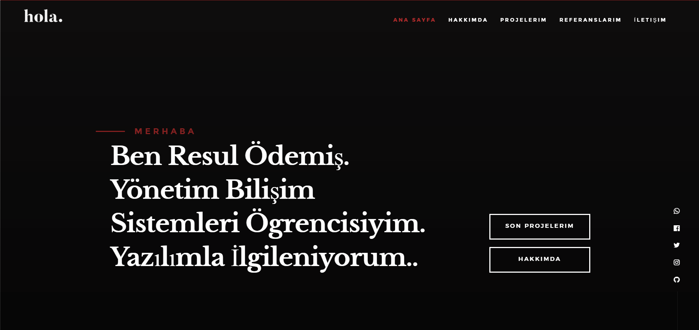
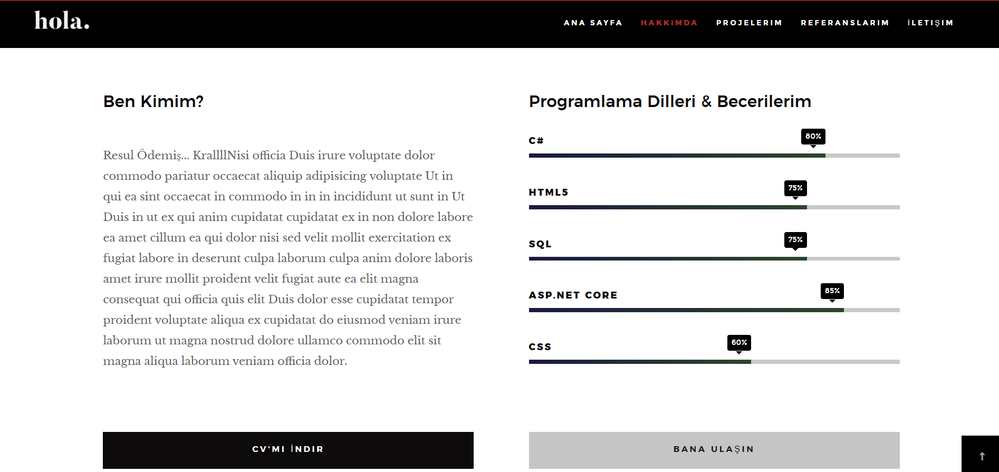
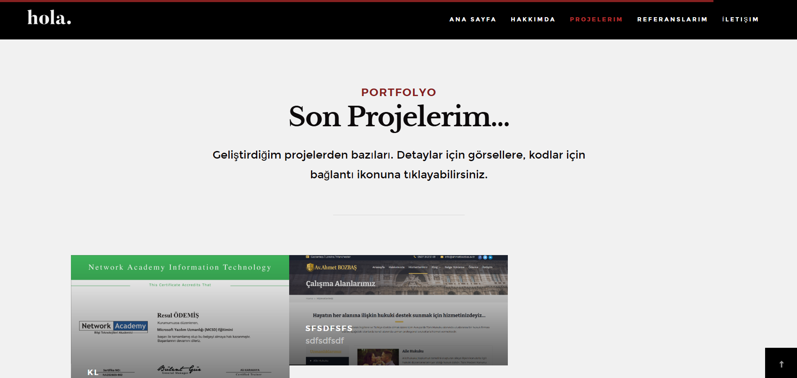
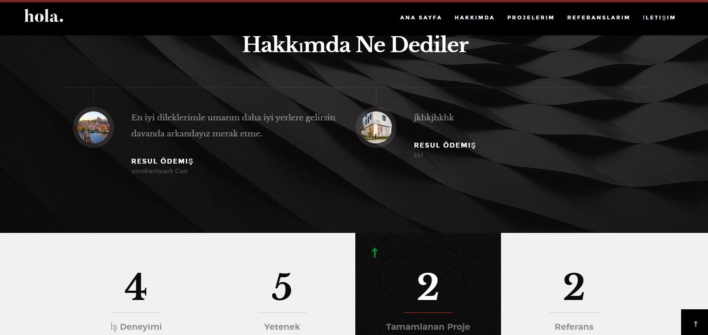
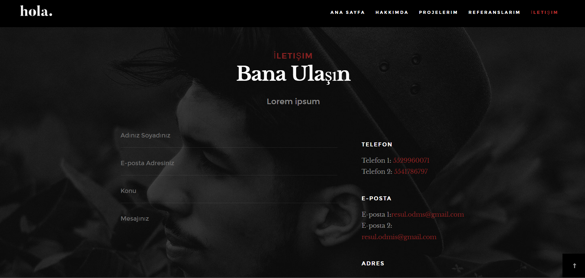
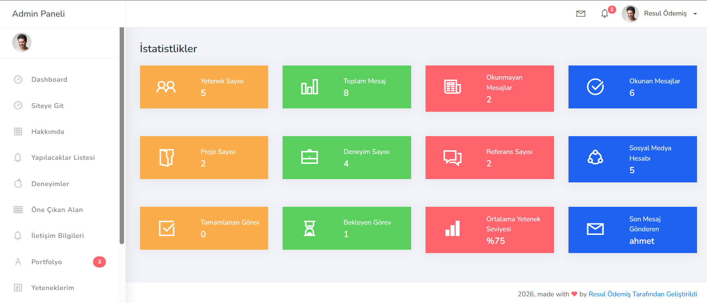
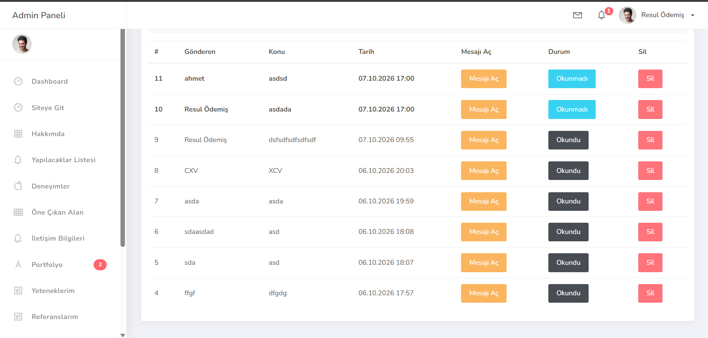
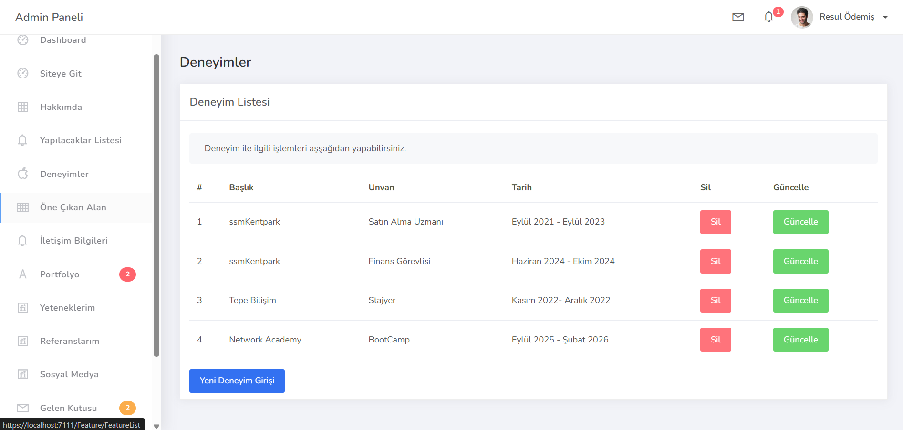
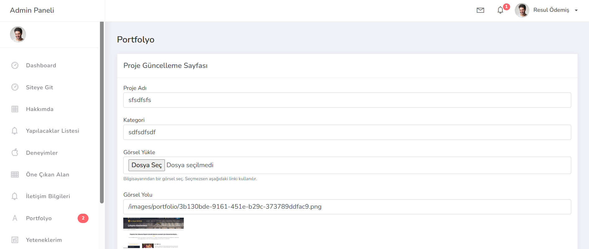

# 💼 ReyPortfolio - Admin Panelli Dinamik Portfolyo Sitesi

<p align="center">
  
</p>

**ASP.NET Core 8.0 MVC** ile geliştirilmiş, tüm içeriği bir **yönetim panelinden** düzenlenebilen kişisel portfolyo ve CV sitesi. Ziyaretçilerin gördüğü site (Hakkımda, Yetenekler, Deneyimler, Projeler, Referanslar, İletişim) tamamen **SQL Server** veritabanından beslenir; admin paneli üzerinden ekleme, güncelleme ve silme yapılabilir. **Entity Framework Core (Code First)**, **View Component** mimarisi ve **Cookie Authentication** kullanılmıştır. Tüm arayüz Türkçedir.

<p align="center">
  
  
  
  
  
</p>

---

## 📑 İçindekiler

- [Site Özellikleri](#-site-özellikleri)
- [Yönetim Paneli](#️-yönetim-paneli)
- [Kurs Üzerine Eklediklerim](#-kurs-üzerine-eklediklerim)
- [Teknoloji Stack](#-teknoloji-stack)
- [Mimari](#️-mimari)
- [Veritabanı Şeması](#️-veritabanı-şeması)
- [Kurulum](#-kurulum)
- [Sayfalar ve Adresler](#-sayfalar-ve-adresler)
- [Proje Yapısı](#-proje-yapısı)
- [Kod Örnekleri](#-kod-örnekleri)
- [Teşekkür](#-teşekkür)

---

## 🌐 Site Özellikleri

### 🏠 Karşılama Alanı
Admin panelinden düzenlenen başlık ve tanıtım yazısı. Sağ taraftaki **sosyal medya ikonları** veritabanından gelir; aynı liste footer'da da kullanılır (tek View Component, iki farklı yer).

### 👤 Hakkımda, Yetenekler ve CV
- Kişisel tanıtım metni ve **CV'mi İndir** butonu (CV admin panelinden yüklenir; yüklenmemişse buton otomatik gizlenir)
- Yüzdeye göre dolan **animasyonlu yetenek çubukları**
- Zaman çizelgesi (timeline) görünümünde **iş ve proje deneyimleri**

<p align="center">
  
</p>

### 🖼️ Projeler
Masonry ızgara düzeninde proje kartları; görsele tıklayınca büyük hâli ve açıklaması açılır, bağlantı ikonu projenin GitHub ya da canlı adresine gider. Proje görselleri admin panelinden **bilgisayardan yüklenebilir**.

<p align="center">
  
</p>

### 💬 Referanslar ve İstatistikler
- Kaydırıcı (slider) içinde **fotoğraflı referans yorumları**
- Proje, deneyim, yetenek ve referans sayılarını **veritabanından canlı hesaplayan** istatistik şeridi (sayaç animasyonlu)

<p align="center">
  
</p>

### ✉️ İletişim
- **AJAX** ile sayfa yenilenmeden mesaj gönderimi; mesaj doğrudan admin panelindeki Gelen Kutusu'na düşer
- Türkçe form doğrulama uyarıları
- Tıklanabilir telefon (`tel:`) ve e-posta (`mailto:`) bağlantıları

<p align="center">
  
</p>

---

## 🛠️ Yönetim Paneli

Admin paneli **Cookie Authentication** ile korunur; giriş yapılmadan hiçbir yönetim sayfası açılmaz.

### 📈 Dashboard
12 kartlık istatistik ekranı: toplam / okunan / okunmayan mesajlar, proje, deneyim, referans ve sosyal medya sayıları, tamamlanan ve bekleyen görevler, ortalama yetenek seviyesi ve son mesaj gönderen. Sidebar'da gerçek proje sayısı ve **okunmamış mesaj rozeti** gösterilir.

<p align="center">
  
</p>

### 📥 Gelen Kutusu ve 📝 İçerik Yönetimi

<table>
  <tr>
    <td width="50%" valign="top">
      
      <p align="center"><b>Gelen Kutusu</b><br>En yeni mesaj üstte, okunmamışlar kalın, detaya girince otomatik "okundu"</p>
    </td>
    <td width="50%" valign="top">
      
      <p align="center"><b>CRUD Sayfaları</b><br>Listeleme, ekleme, güncelleme ve onaylı silme</p>
    </td>
  </tr>
</table>

### 🖼️ Görsel Yüklemeli Formlar
Portfolyo ve referans görselleri **bilgisayardan yüklenebilir** ya da link olarak girilebilir. Yüklenen dosyalar benzersiz adlarla `wwwroot/images` altına kaydedilir; güncellemede yeni dosya seçilmezse mevcut görsel korunur.

<p align="center">
  
</p>

### Yönetilebilen Bölümler

| Bölüm | İşlemler |
|---|---|
| Deneyimler, Yetenekler, Öne Çıkan Alan | Listele / Ekle / Güncelle / Sil |
| Portfolyo, Referanslar | Listele / Ekle / Güncelle / Sil + **görsel yükleme** |
| Sosyal Medya | Listele / Ekle / Güncelle / Sil |
| Hakkımda | Güncelle + **PDF CV yükleme** |
| İletişim Bilgileri | Güncelle |
| Gelen Kutusu | Oku / Okundu-Okunmadı / Sil |
| Yapılacaklar Listesi | Listele / Ekle / Güncelle / Sil / Durum değiştir + üst bar bildirimleri |

---

## ⭐ Kurs Üzerine Eklediklerim

Bu proje bir eğitim serisini temel alır (bkz. [Teşekkür](#-teşekkür)). Eğitimde yapılan kısımların üzerine aşağıdakiler tarafımdan eklenmiştir:

- About, Feature, Skill, Social Media, Portfolio, Testimonial ve Contact için **admin CRUD sayfaları** ve sitedeki bölümlerin **dinamik hâle getirilmesi**
- Tek bir View Component'in birden fazla yerde kullanıldığı **dinamik sosyal medya** listesi
- **AJAX** tabanlı iletişim formu ve Gelen Kutusu entegrasyonu
- **Bilgisayardan görsel ve CV yükleme**
- **Cookie Authentication** ile admin girişi ve global yetkilendirme filtresi
- Genişletilmiş **istatistik** sayfası ve sitedeki canlı istatistik şeridi
- **Okunmamış mesaj rozeti**, silme onayı ve Gelen Kutusu iyileştirmeleri
- Şablon kalıntılarının temizlenmesi ve arayüzün **Türkçeleştirilmesi**

---

## 🔧 Teknoloji Stack

| Teknoloji | Versiyon | Açıklama |
|---|---|---|
| **.NET** | 8.0 | Microsoft .NET framework |
| **ASP.NET Core MVC** | 8.0 | Web uygulama çatısı |
| **Entity Framework Core** | 8.0.22 | ORM (Code-First + Migrations) |
| **SQL Server** | Express | İlişkisel veritabanı |
| **Cookie Authentication** | 8.0 | Admin girişi (ek paket gerektirmez) |
| **View Components** | 8.0 | Sayfa bölümlerinin parçalı yapısı |
| **Bootstrap** | 4 | Admin paneli arayüzü |
| **jQuery / AJAX** | 3.x | İletişim formu ve etkileşimler |
| **Hola** | - | Site teması (StyleShout) |
| **Ready Bootstrap Dashboard** | - | Admin teması (ThemeKita) |

---

## 🏗️ Mimari

Proje tek bir ASP.NET Core MVC uygulamasıdır; site ve admin paneli aynı projede, farklı controller'lar ve layout'lar ile ayrılmıştır.

```
  Ziyaretçi ───────▶ DefaultController  [AllowAnonymous]
                       └─ View Components (Feature, About, Skill, Experience,
                          Portfolio, Testimonial, Statistic, Contact, SocialMedia)

  Admin ──▶ LoginController ──(Cookie)──▶ Admin Controller'ları  [Authorize]
                                           Statistic, Message, ToDoList, Experience,
                                           Skill, Feature, About, SocialMedia,
                                           Portfolio, Testimonial, Contact
                                                     │
                                                     │ EF Core
                                                     ▼
                                           SQL Server · ReyPortfolioDb
```

- **Site**: `DefaultController` tek bir sayfa döndürür; her bölüm kendi verisini çeken bir **View Component**'tir.
- **Admin**: Tüm controller'lar `Program.cs`'teki global `AuthorizeFilter` ile korunur; yalnızca `Default`, `Login` ve `Home` controller'ları `[AllowAnonymous]` ile açıktır.

---

## 🗄️ Veritabanı Şeması

Proje **SQL Server** üzerinde **EF Core Code-First** yaklaşımı ve **Migration** kullanır.

```
📊 Veritabanı: ReyPortfolioDb (SQL Server)

├── Features        → Karşılama alanı (başlık, açıklama)
├── Abouts          → Hakkımda (başlık, kısa açıklama, detay)
├── Skills          → Yetenekler (ad, yüzde)
├── Experiences     → Deneyimler (firma, unvan, tarih, açıklama)
├── Portfolios      → Projeler (ad, kategori, görsel, link, açıklama)
├── Testimonials    → Referanslar (ad soyad, unvan, yorum, fotoğraf)
├── SocialMedias    → Sosyal medya hesapları (ad, ikon, link)
├── Contacts        → İletişim bilgileri (telefon, e-posta, adres)
├── Messages        → Gelen mesajlar (gönderen, konu, mesaj, tarih, okundu)
└── ToDoLists       → Yapılacaklar (başlık, tarih, görsel, durum)
```

> Admin kullanıcı bilgileri veritabanında değil `appsettings.json` içinde tutulur. Yüklenen görseller `wwwroot/images`, CV ise `wwwroot/files/cv.pdf` altında saklanır.

---

## 🚀 Kurulum

### Gereksinimler

- [.NET 8.0 SDK](https://dotnet.microsoft.com/download)
- [SQL Server](https://www.microsoft.com/sql-server) (Express yeterli)
- Visual Studio 2022

### 1. Depoyu Klonlayın

```bash
git clone https://github.com/resulodms/ReyPortfolio.git
cd ReyPortfolio
```

### 2. Veritabanı Bağlantısını Kontrol Edin

`ReyPortolio/DAL/Context/MyPortfolioContext.cs` içindeki bağlantı dizesi varsayılan olarak yerel SQL Server Express'i kullanır. Farklı bir sunucu kullanıyorsanız güncelleyin:

```csharp
optionsBuilder.UseSqlServer(
    "Server=.\\SQLEXPRESS;Initial Catalog=ReyPortfolioDb;Integrated Security=true;TrustServerCertificate=true");
```

### 3. Veritabanını Oluşturun

Visual Studio'da **Tools → NuGet Package Manager → Package Manager Console**:

```powershell
Update-Database
```

### 4. Uygulamayı Çalıştırın

`ReyPortfolio.sln` dosyasını açın ve **F5** ile çalıştırın.

### 5. Admin Paneline Giriş

| | |
|---|---|
| **Giriş adresi** | `/Login/Index` |
| **Kullanıcı adı** | `admin` |
| **Şifre** | `Demo123!` |

> Giriş bilgileri `appsettings.json` içindeki `AdminUser` bölümünden değiştirilebilir. Veritabanı ilk oluşturulduğunda boştur; içerikleri admin panelinden ekleyebilirsiniz. **Hakkımda** ve **İletişim Bilgileri** sayfaları için tabloda birer kayıt bulunmalıdır.

---

## 🧭 Sayfalar ve Adresler

| Adres | Açıklama | Erişim |
|---|---|---|
| `/` | Portfolyo sitesi | Herkese açık |
| `/Login/Index` | Admin girişi | Herkese açık |
| `/Statistic/Index` | Dashboard / istatistikler | Admin |
| `/Message/Inbox` | Gelen kutusu | Admin |
| `/Portfolio/PortfolioList` | Proje yönetimi | Admin |
| `/Experience/ExperienceList` | Deneyim yönetimi | Admin |
| `/Skill/SkillList` | Yetenek yönetimi | Admin |
| `/Testimonial/TestimonialList` | Referans yönetimi | Admin |
| `/SocialMedia/SocialMediaList` | Sosyal medya yönetimi | Admin |
| `/Feature/FeatureList` | Karşılama alanı yönetimi | Admin |
| `/About/Index` | Hakkımda ve CV yükleme | Admin |
| `/Contact/Index` | İletişim bilgileri | Admin |
| `/ToDoList/Index` | Yapılacaklar listesi | Admin |

---

## 📁 Proje Yapısı

```
ReyPortfolio/
├── README.md
├── screenshots/                       # README görselleri
├── ReyPortfolio.sln
└── ReyPortolio/                       # ASP.NET Core MVC projesi
    ├── Controllers/                   # Default (site), Login, Statistic, Message, ToDoList,
    │                                  #   Experience, Skill, Feature, About, SocialMedia,
    │                                  #   Portfolio, Testimonial, Contact
    ├── DAL/
    │   ├── Context/MyPortfolioContext.cs
    │   └── Entities/                  # About, Feature, Skill, Experience, Portfolio,
    │                                  #   Testimonial, SocialMedia, Contact, Message, ToDoList
    ├── Migrations/                    # EF Core migration'ları
    ├── ViewComponents/                # Site bölümleri
    │   └── LayoutViewComponents/      # Admin layout parçaları (Head, Navbar, Sidebar ...)
    ├── Views/
    │   ├── Default/                   # Site ana sayfası
    │   ├── Login/                     # Admin giriş sayfası
    │   ├── Layout/                    # Admin layout'u
    │   ├── <Admin sayfaları>/         # List / Create / Update view'ları
    │   └── Shared/Components/         # View Component görünümleri
    ├── wwwroot/
    │   ├── hola-master/               # Site teması
    │   ├── Ready-Bootstrap-Dashboard-master/   # Admin teması
    │   ├── images/                    # Yüklenen proje ve referans görselleri
    │   └── files/                     # Yüklenen CV
    ├── appsettings.json               # Admin giriş bilgileri
    └── Program.cs                     # Kimlik doğrulama ve yetkilendirme ayarları
```

---

## 📝 Kod Örnekleri

### Tüm Admin Sayfalarını Tek Yerden Korumak

```csharp
// Program.cs
builder.Services.AddControllersWithViews(options =>
{
    var policy = new AuthorizationPolicyBuilder().RequireAuthenticatedUser().Build();
    options.Filters.Add(new AuthorizeFilter(policy));
});

builder.Services.AddAuthentication(CookieAuthenticationDefaults.AuthenticationScheme)
    .AddCookie(options =>
    {
        options.LoginPath = "/Login/Index";
        options.ExpireTimeSpan = TimeSpan.FromHours(2);
    });
```

### İletişim Formundan Gelen Mesajın AJAX ile Kaydedilmesi

```csharp
[HttpPost]
public IActionResult SendMessage(Message message)
{
    message.SendDate = DateTime.Now;
    message.IsRead = false;
    _context.Messages.Add(message);
    _context.SaveChanges();
    return Content("OK");   // Şablonun JavaScript'i "OK" yanıtıyla başarı mesajını gösterir
}
```

### Benzersiz Adla Görsel Yükleme

```csharp
if (imageFile != null && imageFile.Length > 0)
{
    var newFileName = Guid.NewGuid() + Path.GetExtension(imageFile.FileName);
    var fullPath = Path.Combine(Directory.GetCurrentDirectory(), "wwwroot", "images", "portfolio", newFileName);

    using (var stream = new FileStream(fullPath, FileMode.Create))
    {
        imageFile.CopyTo(stream);
    }
    portfolio.ImageUrl = "/images/portfolio/" + newFileName;
}
```

---

## 🎓 Bu Projede Öğrenilenler

- ✅ ASP.NET Core 8.0 **MVC** mimarisi
- ✅ **Entity Framework Core** Code-First ve Migration
- ✅ **View Component** ile parçalı sayfa yapısı ve bir component'in birden çok yerde kullanımı
- ✅ Admin paneli için **CRUD** işlemleri
- ✅ **AJAX** ile sayfa yenilemeden form gönderimi
- ✅ `IFormFile` ile **dosya yükleme**
- ✅ **Cookie Authentication**, `[AllowAnonymous]` ve global yetkilendirme filtresi
- ✅ LINQ ile raporlama (`Count`, `Where`, `Average`, `OrderByDescending`)
- ✅ Hazır HTML temalarının Razor ile dinamik hâle getirilmesi

---

## 🙏 Teşekkür

Bu proje, **Murat Yücedağ**'ın ücretsiz Udemy eğitim serisi temel alınarak geliştirilmiş, ardından kendi eklediğim özelliklerle genişletilmiştir:

- [Asp.Net Core ile Portfolyo Uygulamanızı Geliştirin - Part 2](https://www.udemy.com/course/aspnet-core-ile-portfolyo-uygulamanz-gelistirin-part-2/)

Kullanılan temalar: **Hola** (StyleShout) ve **Ready Bootstrap Dashboard** (ThemeKita).

---

<p align="center">
  <b>⭐ Bu projeyi yararlı bulduysanız star vermeyi unutmayın! ⭐</b><br>
  Resul Ödemiş tarafından ASP.NET Core & SQL Server ile geliştirildi.
</p>
